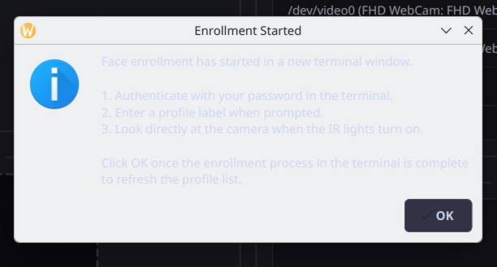
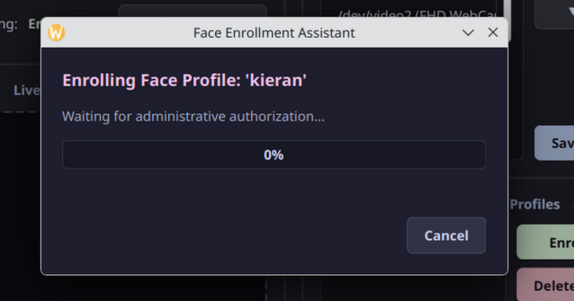
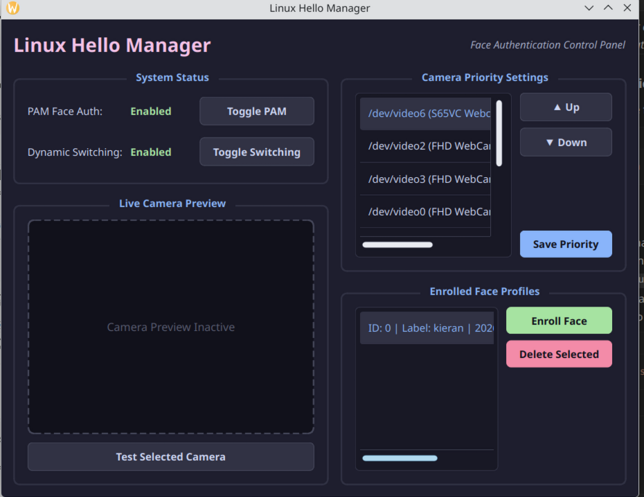
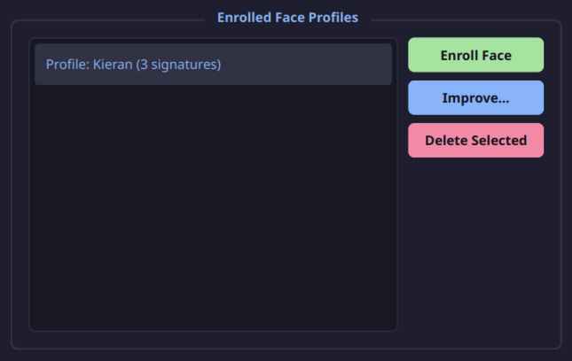

# User Guide: How to Use Linux Hello

This guide walks you through using the **Linux Hello** graphical control panel to test your camera, enroll face signatures, improve recognition accuracy, and configure face authentication on your system.

---

## 1. Launching the Dashboard

You can open the control panel in two ways:
*   **Application Launcher**: Search for **Linux Hello** in your desktop menu (Kickoff/Kicker) and launch it.
*   **Terminal**: Open a terminal and run:
    ```bash
    linux-hello gui
    ```

Once opened, you will see the main dashboard:

<p align="center">
  
</p>

### Interface Modules
*   **System Status (Left)**: Toggles PAM face authentication (logins/sudo) and dynamic camera hotplug switching.
*   **Live Camera Preview (Left)**: A viewport for testing connected webcams.
*   **Camera Priority (Right)**: Arrange priorities (Up/Down) for multiple connected cameras.
*   **Enrolled Face Profiles (Right)**: List of active user profiles and tools to enroll/delete face signatures.

---

## 2. Testing Your Camera

Before enrolling your face, verify that your webcam streams correctly. 

1.  Select a video device from the **Camera Priority Settings** list on the right. If it is an Infrared webcam, it will be marked with `[IR]`.
2.  Click **Test Selected Camera**.
3.  The viewport on the left will stream a live preview. Move your head to ensure the feed is working and lag-free:

<p align="center">
  
</p>

4.  Click **Stop Test** to release the camera hardware.

> [!NOTE]
> If you are using an Infrared (IR) camera, the preview feed will appear in **black and white (grayscale)** and may show a **noticeable flashing or pulsing effect**. This is completely normal behavior: the active IR emitters pulse rapidly to illuminate and map your face geometry.

---

## 3. Enrolling Your Face

To create your initial facial profile:

1.  Click **Enroll Face** on the bottom right.
2.  You will be prompted to enter a **Profile Label** (defaults to your Linux username).
3.  Type a label and click **OK**.
4.  The **Face Enrollment Assistant** will open and start a **5-second countdown** to let you position yourself:

<p align="center">
  
</p>

5.  Align your face within the dashed camera box.
6.  When the countdown reaches `0`, the preview releases the camera node, and the scanner runs in the background. Look directly at the camera until the progress bar fills green.

---

## 4. Improving Profile Accuracy

For the best match rates under different lighting conditions, postures, or if you wear glasses:

1.  Select your user profile in the **Enrolled Face Profiles** list.
2.  Click **Improve...**:

<p align="center">
  
</p>

3.  The enrollment assistant will launch. Follow the same steps to record an additional signature.
4.  Linux Hello automatically groups multiple face signatures under a unified label (e.g. `Profile: kieran (2 signatures)`), keeping your dashboard tidy.

### Face Profile Security Matcher
If another person attempts to enroll a signature into your profile, the matching algorithm calculates the Euclidean distance to your existing vectors. 
If the distance exceeds the verification threshold (`0.55`), `Linux Hello` will **reject the scan, automatically delete the signature**, and display a red security warning dialog:
`Security Alert: Face did not match the owner of this profile. Signature rejected!`

---

## 5. Activating Face Authentication

Once your profile is enrolled:

1.  Click **Toggle PAM** in the **System Status** box.
2.  Authenticate the graphical PolicyKit prompt.
3.  Face Authentication will show as **Enabled** (marked green).
4.  **Test it**: Open a new terminal and type:
    ```bash
    sudo whoami
    ```
    Your webcam's active lights should turn on, scan your face, and authorize the command without prompting for a password!
